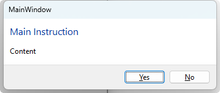
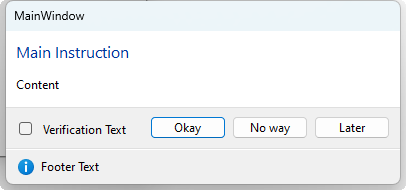
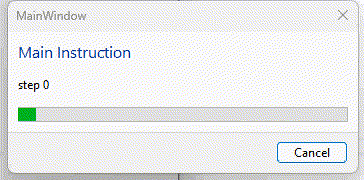

# XTaskDialog
A .NET library that wraps the [Win32 Task Dialog](https://learn.microsoft.com/en-us/windows/win32/api/commctrl/nf-commctrl-taskdialog) API.

## Message Box
For a simple message box use the static method TaskDialog.Show:
```csharp
TaskDialogResult result = TaskDialog.Show(parent, "Main Instruction", "Content",
                                            TaskDialogButton.Yes|TaskDialogButton.No);
if (result == TaskDialogResult.Yes)
{
    // ....
}
```


For more advanced usages, such as displaying a footer, verification check box, etc...  Construct an instance of TaskDialog and set its properties:
```csharp
TaskDialog dlg = new TaskDialog(parent, "Main Instruction", "Content");
dlg.VerificationText = "Verification Text";
dlg.FooterText = "Footer Text";
dlg.FooterIcon = TaskDialogIcon.Information;
dlg.Buttons = TaskDialogButton.None;
dlg.CustomButtons = new TaskDialogCustomButton[]
{
    new TaskDialogCustomButton((int)TaskDialogResult.Yes, "Okay"),
    new TaskDialogCustomButton((int)TaskDialogResult.No, "No way"),
    new TaskDialogCustomButton(101, "Later")
};

TaskDialogResult result = dlg.Show(out bool verificationChecked);
if (result == TaskDialogResult.Yes)
{
    // ...
}
```


## Progress Dialog
When the progress dialog is passed a `System.Threading.Tasks.Task` it will be displayed until the task is complete, throws an exception or is canceled.  It supports both Task and Task&lt;T&gt;.

If you can provide a method that creates the task then its as simple as:
```csharp
try
{
    // ProgressDialog.Show will pass a CancellationToken and a progress object to the delegate
    int result = ProgressDialog.Show((c, p) => MyMethodAsync(c, p), parent, "Main Instruction", "Content");
    
    // Do something with result...
}
catch (OperationCanceledException)
{
    // The user clicked the cancel button
}
catch (Exeception e)
{
    // The task threw an exception
}

// Dummy async method
private async Task<int> MyMethodAsync(CancellationToken cancellation, IProgress<ProgressDialogProgressInfo> progress)
{
    for (int i = 0; i < 10; i++)
    {
        cancellation.ThrowIfCancellationRequested();

        progress.Report(new ProgressDialogProgressInfo()
        {
            Content = $"step {i}",
        });

        await Task.Delay(1000);
    }

    return 123;
}
```


To display a progres dialog for an already running task or existing cancellation token do:
```csharp
// Create the cancellation token (optional)
using (CancellationTokenSource cts = new CancellationTokenSource())
{
    // Create the progress info (optional)
    ProgressDialogProgressInfo progressInfo = new ProgressDialogProgressInfo();

    // Start the task
    Task<int> task = TestAsync(cts.Token, new Progress<ProgressDialogProgressInfo>(p => progressInfo.SetFrom(p)));

    try
    {
        // Display the progress dialog - it wont display if the task is already complete
        int result = ProgressDialog.Show(task, parent, "Main Instruction", "Content", cts, progressInfo);

        // Do something with result...
    }
    catch (OperationCanceledException)
    {
        // The user clicked the cancel button
    }
    catch (Exeception e)
    {
        // The task threw an exception
    }
}
```
## Notes about WPF and the parent window
The methods can take the HWND of the parent window as an IntPtr.  If you pass IntPtr.Zero the message/progress dialog will have no parent (meaning that it will go behind your window).

In WPF you can obtain the HWND for a window using the `System.Windows.Interop.WindowInteropHelper` class, such as:
```csharp
// Get the HWND of the WPF window
WindowInteropHelper helper = new WindowInteropHelper(myWpfWindow);

// Display a message box where its parent will be the WPF window
TaskDialog.Show(helper.Handle, "Main Instruction", "Content");
```